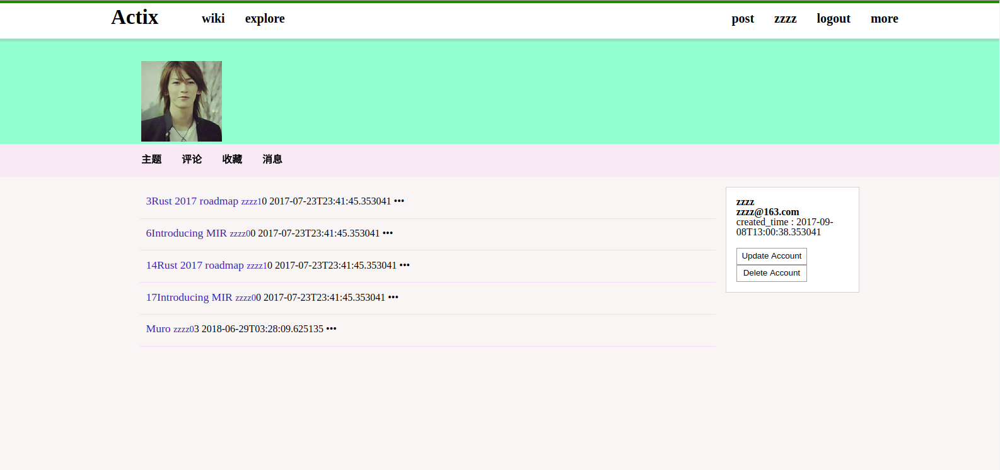

# Actix-cn [](https://travis-ci.org/actix-cn/actix-cn)

Actix-cn is single page forum webapp written in [actix-web](https://github.com/actix/actix-web) with vuejs.
- Async stable Actix-web framework 
- diesel, postgresql r2d2
- SPA CORS JWT
- Vuejs 

## How To
    first create a name 'actix_cn' postgresql database for this project.

## when development 
```bash
$ git clone https://github.com/actix-cn/actix-cn.git
$ cd actix-cn
$ cargo install diesel_cli --no-default-features --features postgres
$ diesel setup
$ cargo run

// another shell nodejs(v10.1.0 on my machine)

$ cd actix-cn/webapp
$ npm install
$ npm run serve
```
then open browser 'http://localhost:8080'

## when production

```bash
$ git clone https://github.com/OUISRC/actix-cn.git
$ cd actix-cn
$ cargo install diesel_cli --no-default-features --features postgres
$ diesel setup
$ cd webapp
$ npm install
$ npm run build
$ cd ..
$ cargo run --release
```
then open broswer 'http://localhost:8000/'

### <a name="screenshots"> What it looks like </a>




## Contribute
 
welcome to contribute !
